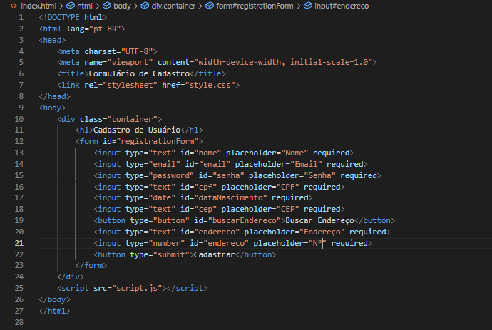

# Formulário de Cadastro 

Este projeto consiste em um formulário de cadastro. O formulário coleta informações do usuário, incluindo nome, e-mail, senha, CPF, data de nascimento e endereço. Ele também realiza validações de e-mail e CPF e utiliza a API ViaCEP para buscar o endereço a partir do CEP.

## Tecnologias Utilizadas

- **HTML**: Estrutura da página.
- **CSS**: Estilização do formulário.
- **JavaScript**: Lógica de validação e manipulação do DOM.
- **API ViaCEP**: Para busca de informações de endereço a partir do CEP.

## Funcionalidades

- **Cadastro de Usuário**: Permite ao usuário se cadastrar fornecendo as informações solicitadas.
- **Validações**:
  - **Email**: Validação para garantir que o formato do e-mail está correto.
  - **CPF**: Validação simples para garantir que o CPF possui 11 dígitos.
- **Busca de Endereço**: Utiliza a API ViaCEP para preencher automaticamente o endereço a partir do CEP informado.

## Estrutura do código
### JavaScript

### HTML

## Como Usar

1. Preencha os campos do formulário.
2. Clique no botão "Buscar Endereço" após inserir o CEP para preencher automaticamente os campos de endereço.
3. Após preencher todos os campos, clique em "Cadastrar" para simular o envio do formulário. Validações de e-mail e CPF serão executadas.
4. Caso haja erros, mensagens de alerta serão exibidas.

## Exemplos de Validação

- **Email Inválido**: Caso o usuário insira um e-mail em um formato inválido, será exibida uma mensagem de alerta.
- **CPF Inválido**: Se o CPF não tiver 11 dígitos, uma mensagem de alerta será exibida.

## Contato

- **Ana Laura Cenali**: analauracenali@gmail.conm
- **GitHub**: [Ana Laura Cenali](https://github.com/anacenali)

